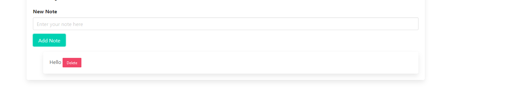

# Notes-App
This is a simple HTML and vue js to create note(sticky notes) virtual 

Table of Contents
=================

  * [Main](#dockerfilevim)
  * 
  * [Diego Castillo](#license)

###  How it works
This app was created to add notes virtually instead of writting down by hand. There is the function to delete the note if you like 

